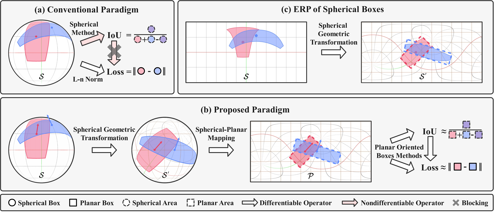
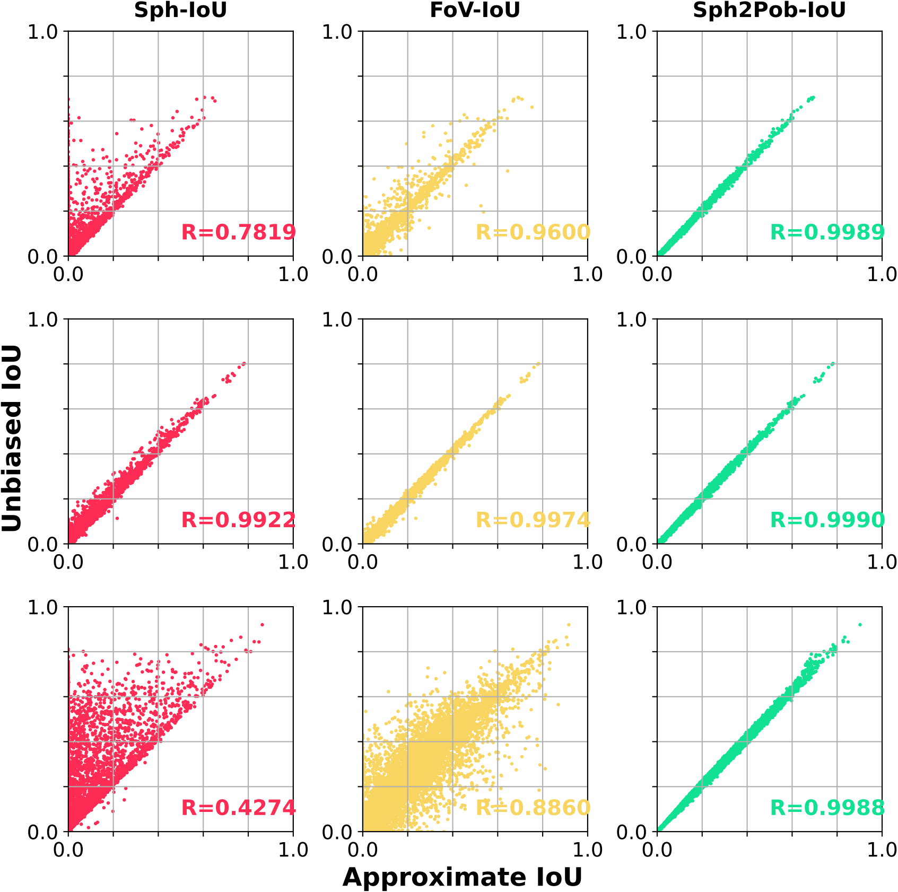
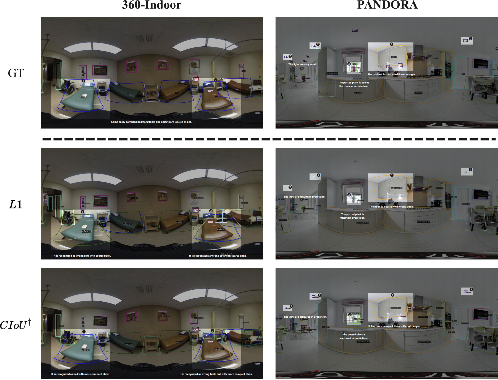

# Sph2Pob: Boosting Object Detection on Spherical Images with Planar Oriented Boxes Methods (IJCAI 2023)

[](https://ijcai-23.org/)
[](https://pytorch.org/)
[](https://github.com/open-mmlab/mmdetection/tree/2.x)
[](https://github.com/AntXinyuan/sph2pob/blob/master/LICENSE)

This repository is an official implementation (PyTorch) of the **IJCAI 2023 paper** [Sph2Pob: Boosting Object Detection on Spherical Images with Planar Oriented Boxes Methods](https://www.ijcai.org/proceedings/2023/0137.pdf).

# Introduction
 **TL; DR.** Sph2Pob is a new paradiam for spherical object detection, where spherical boxes are transformed to planar oriented boxes, and then IoU and Loss are indirectly calculated.

<p align="center">

</p>

**Abstract.** Object detection on panoramic/spherical images has been developed rapidly in the past few years, where IoU-calculator is a fundamental part of various detector components, i.e. Label Assignment, Loss and NMS.
Due to the low efficiency and non-differentiability of spherical Unbiased IoU, spherical approximate IoU methods have been proposed recently.
We find that the key of these approximate methods is to map spherical boxes to planar boxes.
However, there exists two problems in these methods: (1) they do not eliminate the influence of panoramic image distortion; (2) they break the original pose between bounding boxes.
They lead to the low accuracy of these methods.
Taking the two problems into account, we propose a new sphere-plane boxes transform, called Sph2Pob. Based on the Sph2Pob, we propose (1) an differentiable IoU, Sph2Pob-IoU, for spherical boxes with low time-cost and high accuracy and (2) an agent Loss, Sph2Pob-Loss, for spherical detection with high flexibility and expansibility. Extensive experiments verify the effectiveness and generality of our approaches, and Sph2Pob-IoU and Sph2Pob-Loss together boost the performance of spherical detectors.

# Updates
- (16/08/2023) The [paper](https://www.ijcai.org/proceedings/2023/0137.pdf) is released!
- (25/07/2023) The [poster](docs/sph2pob-poster-web.pdf) about our paper is released!
- (01/07/2023) The [slides](docs/sph2pob-slides-web.pdf) about our paper is released!
- (18/05/2023) The codes about SPh2Pob-IoU and corresponding tests are released! 

# Main Results
## Comprehensive Comparison

| Method    | Consistency |           |            | Time-cost⋆ |            | Detection* |           |           |
| --------  | ----------- | --------- | ---------- | --------- | ---------- | ---------  | --------- | --------- |
|           | $R_{all}$   | $R_{low}$ | $R_{high}$ | $T_{cpu}$ | $T_{cuda}$ | $AP$       | $AP_{50}$ | $AP_{75}$ |
| Sph       | 0.7819      | 0.9922    | 0.4274     | 0.0364    | 0.0033     | 10.7       | 24.3      | 7.8       |
| Fov       | 0.9600      | 0.9974    | 0.8860     | 0.0372    | 0.0034     | 10.9       | 25.0      | 7.9       |
| Sph2Pob   | 0.9989      | 0.9990    | 0.9988     | 2.2275    | 0.0096     | 11.5       | 25.7      | 8.2       |
| Unbiased† | 1.000       | 1.000     | 1.000      | 46.4417   | -          | -          | -         | -         |

† Unbiased-IoU is non-differentiable, and it do not support cuda.

⋆ Time-cost refers to the total computational time (unit:second) of IoU fro 1,000,000 spherical box-pairs.

\* Sph-IoU and Fov-IoU are designed only for BFoV, so detection results are reported with [Retinanet](https://arxiv.org/abs/1708.02002) on 360-Indoor dataset (RFoV).


## Detection Comparison

| Detector      | Loss         | 360-Indoor |      |      | PANDORA |      |      |
| ------------  | ------------ | ---------- | ---- | ---- | ------- | ---- | ---- |
|               |              | $AP$         | $AP_{50}$   | $AP_{75}$ | $AP$      | $AP_{50}$ | $AP_{75}$ |
| Faster R-CNN* | L1           | 12.5       | 28.1 | 9.1  | 11.0    | 27.8 | 6.2  |
|               | Sph2Pob+CIoU | 12.9       | 29.1 | 9.4  | 11.3    | 28.6 | 7.1  |
| SSD*          | L1           | 10.8       | 27.6 | 6.3  | 9.5     | 25.8 | 4.6  |
|               | Sph2Pob+CIoU | 12.0       | 28.7 | 8.0  | 10.5    | 26.9 | 6.0  |
| Retinanet*    | L1           | 10.2       | 23.0 | 7.8  | 10.3    | 24.3 | 6.6  |
|               | Sph2Pob+CIoU | 11.5       | 25.7 | 8.2  | 10.5    | 25.3 | 7.0  |
| FCOS*         | L1           | 8.8        | 20.2 | 6.7  | 7.7     | 19.7 | 4.4  |
|               | Sph2Pob+CIoU | 9.2        | 21.0 | 7.0  | 8.8     | 21.2 | 5.6  |

\* All detectors output spherical bboxes, i.e., BFoV for 360-Indoor and RBFoV for PANDORA, respectively.

## IoU Comparison
<p align="center">

</p>

## Visualized Comparison
<p align="center">

</p>

# Installation
## Requirements
> The codebase is built on top of mmcv/mmdet/mmrotate

- Linux, CUDA >= 11.2, GCC = 7.5
- Python >= 3.8

  We recommend you to use Anaconda to create a conda environment:
  ```bash
  conda create -n sph2pob python=3.8
  ```
  Then, activate the environment:
  ```bash
  conda activate sph2pob
  ```
- PyTorch >= 1.11.0, torchvision >= 0.12.0

  For example, if your CUDA version is 11.3, you could install pytorch and torchvision as following:
  ```bash
  pip install torch==1.12.1+cu113 torchvision==0.13.1+cu113 --extra-index-url https://download.pytorch.org/whl/cu113
  ```
- mmcv-full = 1.6.0, mmdet = 2.25.2, mmrotate = 0.3.2

  Note that "mm series" frameworks recently released a major update(3.x), which is not fully compatible with previous versions. (See also in [https://mmdetection.readthedocs.io/en/3.x/migration/migration.html](https://mmdetection.readthedocs.io/en/3.x/migration/migration.html))
  ```bash
  pip install -U openmim
  mim install mmcv-full==1.6.0
  mim install mmdet==2.25.2
  mim install mmrotate==0.3.2
  ```
- Other requirements
  ```bash
  pip install numpy, matplotlib, tensorboard
  ```

## Datasets
- [360-Indoor](https://openaccess.thecvf.com/content_WACV_2020/html/Chou_360-Indoor_Towards_Learning_Real-World_Objects_in_360deg_Indoor_Equirectangular_Images_WACV_2020_paper.html) (BFoV) is available at [https://aliensunmin.github.io/project/360-dataset/#dataset](https://aliensunmin.github.io/project/360-dataset/#dataset)

- [PANDORA](https://link.springer.com/chapter/10.1007/978-3-031-20074-8_14) (RBFoV) is available at [https://github.com/tdsuper/SphericalObjectDetection#pandora-dataset](https://github.com/tdsuper/SphericalObjectDetection#pandora-dataset).

# Usage
## IoU API
In sphdet/iou/\_\_init\_\_.py, we provide a few IoU calculator, inculding:

- [sph2pob_legacy_iou] A legacy implement of Sph2Pob based on handcraft rules
- [sph2pob_standard_iou]  A standard implement of Sph2Pob based on Spherical Geometric Transformation.
- [sph2pob_efficient_iou] A efficient implement of Sph2Pob based on geometric relationship.

- [naive_iou] A naive approximate IoU based on planar IoU on ERP-plane.
- [sph_iou] Our implement for [Sph-IoU](https://ojs.aaai.org/index.php/AAAI/article/view/6995).
- [fov_iou]  Our implement for [FoV-IoU](https://arxiv.org/abs/2202.03176).

- [unbiased_iou] [Official implement](https://github.com/tdsuper/SphericalObjectDetection) for [Unbiased-IoU](https://ojs.aaai.org/index.php/AAAI/article/view/19929).

## Loss API
In sphdet/losses/\_\_init\_\_.py, we provide a few loss functions, including:

- [SphL1Loss] Sph -> L1 Loss

- [Sph2PobL1Loss] Sph2Pob -> L1 Loss
- [Sph2PobIoULoss] Sph2Pob -> [IoU](https://arxiv.org/abs/1608.01471)/[GIoU](https://arxiv.org/abs/1902.09630)/[DIoU](https://arxiv.org/abs/1911.08287)/[CIoU](https://arxiv.org/abs/2005.03572) Loss
- [Sph2PobGDLoss] Sph2Pob -> [GWD](https://arxiv.org/abs/2101.11952)/[KLD](https://arxiv.org/abs/2106.01883) Loss
- [Sph2PobKFLoss] Sph2Pob -> [KFIoU](https://arxiv.org/abs/2201.12558) Loss

## Comparsion
In tests/test_all_ious.py, we provide a few performance comparsion functions, including:

- [test_ious_time] Comparison of time-cost.
- [test_ious_single_smaple] Comparison of IoU-values for single samples.
- [test_ious_time_curve] Plot time v.s. data_scale curve.
- [test_iou_scatter] Plot Approximate v.s. Unbiased IoU scatter.
- [test_iou_error] Comparison of error's statistical properties.  
- [test_iou_angle] Plot IoU v.s. Internal Angle distribution.

## Visualization
In tests/test_visualizer.py, we provide a visualization about Sph2Pob-Transform

- [test_sph_visualizer] Plot spherical \& planar bboxes on ERP-plane based on Sph2Pob-Transform.


# Citation

If you find Sph2Pob useful in your research, please consider citing:

```bibtex
@inproceedings{liu2023sph2pob,
  title     = {Sph2Pob: Boosting Object Detection on Spherical Images with Planar Oriented Boxes Methods},
  author    = {Liu, Xinyuan and Xu, Hang and Chen, Bin and Zhao, Qiang and Ma, Yike and Yan, Chenggang and Dai, Feng},
  booktitle = {Proceedings of the Thirty-Second International Joint Conference on
               Artificial Intelligence, {IJCAI-23}},
  publisher = {International Joint Conferences on Artificial Intelligence Organization},
  editor    = {Edith Elkind},
  pages     = {1231--1239},
  year      = {2023},
  month     = {8},
  note      = {Main Track},
  doi       = {10.24963/ijcai.2023/137},
  url       = {https://doi.org/10.24963/ijcai.2023/137},
}
```
